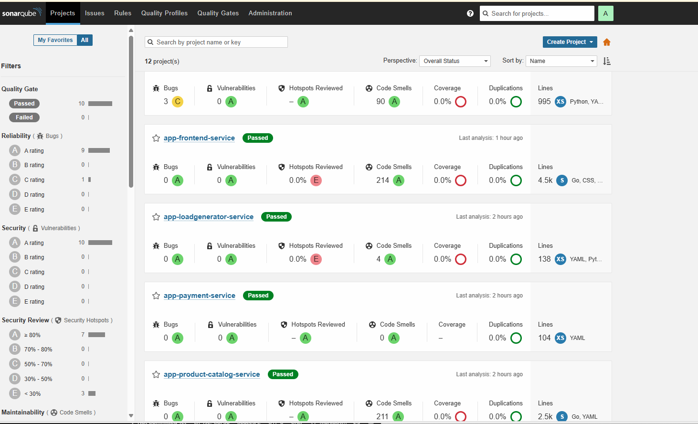
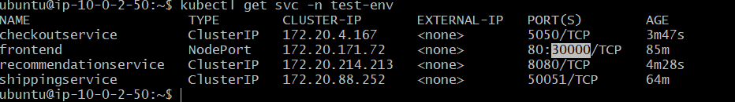
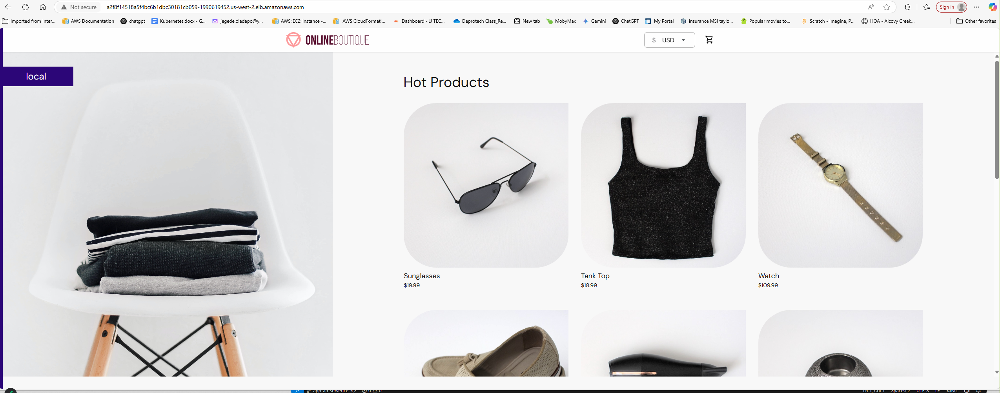

# Terraform CI/CD Infrastructure on AWS

This Terraform module provisions a complete Continuous Integration / Continuous Deployment (CI/CD) environment in Amazon Web Services (AWS) using the `us-west-2` region. The setup includes a Virtual Private Cloud (VPC), public subnets, routing, Amazon Elastic Compute Cloud (EC2) instances for Jenkins, Prometheus, Grafana, and SonarQube, with security groups and Identity and Access Management (IAM) roles configured for access and automation.

Navigate to onlineboutique-infra/eks-cluster-ec2. Edit provider.tf and change the value of the "Name" to the AWS user account you intend to use (shown below)

provider "aws" {
  region = "us-west-2"

  default_tags {
    tags = {
      Name = "insert_aws_account_name_here"
    }
  }
}

Navigate to onlineboutique-infra/main-cicd. Edit ec2.tf and change the value of the "Name" to the AWS user account you intend to use (shown below):

provider "aws" {
  region = "us-west-2"

  default_tags {
    tags = {
      Name = "insert_aws_account_name_here"
    }
  }
}

Enter this to create a key for "postgres":

aws ec2 create-key-pair --key-name postgreskey --query "KeyMaterial" --output text > postgreskey.pem

Verify
aws ec2 describe-key-pairs --query "KeyPairs[*].KeyName"

Should show:

'''
[
    "postgreskey"
]
'''

#### Amazon Elastic Kubernetes Service (EKS) CLUSTER
cd into eks-cluster-ec2 and enter:

- terraform init
- terraform plan
- terraform apply

This will automatically setup your EKS cluster.

#### CICD PIPELINE
cd into main-cicd and enter:

- terraform init
- terraform plan
- terraform apply

This will also automatically setup your instances for:
- sonaqube
- jenkins
- prometheus
- grafana

- 
- 

#### The architectural diagram above illustrates a DevSecOps CI/CD infrastructure on AWS, enhanced with observability using Prometheus and Grafana. Here's a breakdown of each component and their interaction:

- ✅ Core Components & Flow
- 🏗️ Terraform-Based Provisioning infrastructure (EC2 instances, VPC, subnets, security groups)
- ☁️ AWS Cloud: The platform hosting all EC2 instances
- 🔁 CI/CD Pipeline (Orchestrated by Jenkins)
- 🧱 Jenkins
- 🧪 SonarQube: Used for SAST (Static Application Security Testing).
- 🛡 Snyk: performs Software Composition Analysis (SCA) for dependency vulnerabilities.
- 🐳 Docker: Jenkins builds and tags Docker images for microservices.
- 📜 OPA/Conftest: scans the Dockerfile for misconfigurations using policy-as-code
- ☸️ Kubernetes (EKS or self-managed): The target environment for application deployment.
- 🔍 Observability: 📊 Prometheus for gathering of metrics + 📈 Grafana for visualization of metrics
- 📣 Notifications: Slack Integration is configured in Jenkins:

### Jenkins setup
1) #### Access Jenkins
    Copy your Jenkins Public IP Address and paste on the browser = ExternalIP:8080
    - Copy the Path from the Jenkins UI to get the Administrator Password
        - Make sure you're still logged into your Jenkins Instance
        - Run the command: `sudo cat /var/lib/jenkins/secrets/initialAdminPassword`
        - Copy the password and login to Jenkins

### Note:  Jenkins URL 

- **`NOTE:`** Copy the Outputed Password and Paste in the `Administrator password` in Jenkins
    - Plugins: Choose `Install Suggested Plugings` 
    - Provide 
        - Username: **`admin`**
        - Password: **`admin`**
        - `Name` and `Email` can also be admin. You can use `admin` all, as its a poc.
    - Click `Continue`
    - Click on `Start using Jenkins`

2)  #### Plugin installations:
    - Click on `Manage Jenkins`
    - Click on `Plugins`
    - Click `Available`
    - Search and Install the following Plugings and `"Install"`
        - **SonarQube Scanner**
        - **Snyk**
        - **Multibranch Scan Webhook Trigger**
        - **Eclipse Temurin installer**
        - **Pipeline: Stage View**
        - **Docker**
        - **Docker Commons**
        - **Docker Pipeline**
        - **docker-build-step**
        - **Docker API**
        - **Kubernetes**
        - **Kubernetes CLI**
        - **Kubernetes Credentials**
        - **Kubernetes Client API**
        - **Kubernetes Credentials Provider**
        - **Kubernetes :: Pipeline :: DevOps Steps**
        - **Slack Notification**
        - **ssh-agent**
        - **BlueOcean**
        - **Build Timestamp**
        - **Prometheus Metrics**
  
    - Click on `Install`
    - Once all plugins are installed
    - Select/Check the Box **`Restart Jenkins when installation is complete and no jobs are running`**

- Refresh your Browser and Log back into Jenkins
    - Once you log back into Jenkins

3)  #### Global tools configuration:
    - Click on Manage Jenkins -->> Global Tool Configuration
    - Click on tools -->> Global Tool Configuration

- **JDK** 
        - Click on `Add JDK` -->> Make sure **Install automatically** is enabled 
        
        **Note:** By default the **Install Oracle Java SE Development Kit from the website** make sure to close that option by clicking on the image as shown below.
        * Name: `JDK17`
        * Click on `Add installer`
        * Select `Install from adoptium.net` 
        * Version: **`jdk-17.0.8.1+1`**

- **Gradle Installation**
      - Click on `Add Gradle`
      - Name: `Gradle`
      - Enable `Install automatically`
      - Version: `8.8`

- **SonarQube Scanner** 
      - Click on `Add SonarQube Scanner` 
      - Name: `SonarScanner`
      - Enable: `Install automatically` 

- **Snyk Installations** 
      - Click on ``Add Snyk`
      - Name: `Snyk`
      - Enable: `Install automatically` 
        - Version: `latest`
        - Update policy interval (hours): `24`
        - OS platform architecture: `Auto-detection`

- **Docker installations** 
      - Click on `Add Docker` 
      - Name: `Docker`
      - Click on `Add installer`
        - Select `Download from docker.com`
        - Docker version: `latest`
      - Enable: `Install automatically` 

Apply and save

4)  #### Credentials setup(SonarQube, Slack, DockerHub, Kubernetes and ZAP):
    - Click on `Manage Jenkins`
      - Click on `Credentials`
      - Click on `Jenkins - System`
      - Click on `Global Credentials (Unrestricted)`
      - Click on `Add Credentials`
      1)  ##### SonarQube secret token (SonarQube-Token)
          - ###### Generating SonarQube secret token:
              - Login to your SonarQube Application (http://SonarServer-Sublic-IP:9000)
                - Default username: **`admin`** 
                - Default password: **`admin`**
            - Click on `Login`
                - Old Password: **`admin`**
                - New Password: **`adminadmin`**
                - Confirm Password: **`adminadmin`**

          ### click on administration and click on projects, management

              - Click on `create project` *(Create the `app-shipping-service` microservice test project)*
                - Project display name: `app-shipping-service`
                - Display key: `app-shipping-service`
                - Main branch name: `app-shipping-service` 
              
              - Click on `Projects` *(Create the `app-recommendation-service` microservice test project)*
                - Project display name: `app-recommendation-service`
                - Display key: `app-recommendation-service`
                - Main branch name: `app-recommendation-service` 
              
              - Click on `Projects` *(Create the `app-product-catalog-service` microservice test project)*
                - Project display name: `app-product-catalog-service`
                - Display key: `app-product-catalog-service`
                - Main branch name: `app-product-catalog-service` 
              
              - Click on `Projects` *(Create the `app-payment-service` microservice test project)*
                - Project display name: `app-payment-service`
                - Display key: `app-payment-service`
                - Main branch name: `app-payment-service` 
              
              - Click on `Projects` *(Create the `app-loadgenerator-service` microservice test project)*
                - Project display name: `app-loadgenerator-service`
                - Display key: `app-loadgenerator-service`
                - Main branch name: `app-loadgenerator-service` 
              
              - Click on `Projects` *(Create the `app-frontend-service` microservice test project)*
                - Project display name: `app-frontend-service`
                - Display key: `app-frontend-service`
                - Main branch name: `app-frontend-service`
              
              - Click on `Projects` *(Create the `app-email-service` microservice test project)*
                - Project display name: `app-email-service`
                - Display key: `app-email-service`
                - Main branch name: `app-email-service` 
              
              - Click on `Projects` *(Create the `app-database` microservice test project)*
                - Project display name: `app-database`
                - Display key: `app-database`
                - Main branch name: `app-database` 
              
              - Click on `Projects` *(Create the `app-currency-service` microservice test project)*
                - Project display name: `app-currency-service`
                - Display key: `app-currency-service`
                - Main branch name: `app-currency-service` 
              
              - Click on `Projects` *(Create the `app-checkout-service` microservice test project)*
                - Project display name: `app-checkout-service`
                - Display key: `app-checkout-service`
                - Main branch name: `app-checkout-service` 
              
              - Click on `Projects` *(Create the `app-cart-service` microservice test project)*
                - Project display name: `app-cart-service`
                - Display key: `app-cart-service`
                - Main branch name: `app-cart-service` 
              
              - Click on `Projects` *(Create the `app-ad-serverice` microservice test project)*
                - Project display name: `app-ad-serverice`
                - Display key: `app-ad-serverice`
                - Main branch name: `app-ad-serverice` 
              - Click on `Set Up`

            - Generate a `Global Analysis Token`    *This is the Token you need for Authorization*
              - Click on the `User Profile / Administrator` icon at top right of SonarQube
              - Click on `My Account`
              - Click `Security`
              - `Generate Token:`   *Generate this TOKEN and Use in the Next Step to Create The SonarQube Credential* 
                - Name: `microservices-web-app-token`
                - Type: `Global Analysis Token`
                - Expires in: `30 days`
              - Click on `GENERATE`
              - NOTE: *`Save The Token Somewhere...`*   sqa_b39f9ce5e1312fe46ffc512f87b520726182e2c4

          - ###### Store Credentials:
              - Navigate back to Jenkins http://JENKINS_PUBLIC_IP:8080
              - Click on `Manage Jenkins` 
                - Click on `Jenkins System`
                - Click `Global credentials (unrestricted)`

          - ###### Store SonarQube Secret Token in Jenkins:     
              - Click on ``Add Credentials``
              - Kind: `Secret text`
              - Secret: `Paste the SonarQube TOKEN` value that we have created on the SonarQube server
              - ID: ``SonarQube-Credential``
              - Description: `SonarQube-Credential`
              - Click on `Create`

      2)  ##### Slack secret token (slack-token)
          - ###### Get The Slack Token: 
              - Slack: https://join.slack.com/t/jjtechtowerba-zuj7343/shared_invite/zt-24mgawshy-EhixQsRyVuCo8UD~AbhQYQ
              - Navigate to the Slack "Channel you created": `YOUR_INITIAL-devsecops-cicd-alerts`
              - Click on your `Channel Drop Down`
              - Click on `Integrations` and Click on `Add an App`
              - Click on `Jenkins CI VIEW` and Click on `Configuration`
              - Click on `Add to Slack`, Click on the Drop Down and `Select your Channel`
              - Click on `Add Jenkins CI Integration`
              - **`NOTE:`** *The TOKEN is on Step 3*

          - ###### Create The Slack Credential For Jenkins:
              - Click on ``Add Credentials``
                - Click on `Jenkins System`
                - Click `Global credentials (unrestricted)`
              - Kind: Secret text            
              - Secret: Place the Integration Token Credential ID (Note: Generate for slack setup)
              - ID: ``Slack-Credential``
              - Description: `Slack-Credential`
              - Click on `Create`  

3)  ##### DockerHub Credential (Username and Password)
      - ###### Login to Your DockerHub Account (You can CREATE one if you Don't have an Account)
      - Access DockerHub at: https://hub.docker.com/
              - Provide Username: `YOUR USERNAME`
              - Provide Username: `YOUR PASSWORD`
              - Click on `Sign In` or `Sign Up`    
                - **NOTE:** *If you have an account `Sign in` If not `Sign up`*

          - ###### DockerHub Credential (Username and Password)
	          - Click on ``Add Credentials``
                - Click on `Jenkins System`
                - Click `Global credentials (unrestricted)`
	          - Kind: Username with password                  
	          - Username: ``YOUR USERNAME``
	          - Password: ``YOUR PASSWORD``
	          - ID: ``DockerHub-Credential``
	          - Description: `DockerHub-Credential`
	          - Click on `Create`   

        - ###### Get Cluster Credential From Kube Config
            - `SSH` back into your `Jenkins-CI` server
            ###  aws configure
            - RUN the command: `aws eks update-kubeconfig --name <clustername> --region <region>`
            ###### aws eks update-kubeconfig --name online-shop-eks-cluster --region us-west-2
            - COPY the Cluster KubeConfig: `cat ~/.kube/config`
            - `COPY` the KubeConfig file content
                - You can use your `Notepad` or any other `Text Editor` as well
                - Open your Local `GitBash` or `Terminal`
                - Create a File Locally
                - RUN: `rm ~/Downloads/kubeconfig-secret.txt`
                - RUN: `touch ~/Downloads/kubeconfig-secret.txt`
                - RUN: `vi ~/Downloads/kubeconfig-secret.txt`
                - `PASTE` and `SAVE` the KubeConfig content in the file

         - ###### Create The Kubernetes Credential In Jenkins
            - Navigate back to Jenkins
            - Click on ``Add Credentials``
                - Click on `Jenkins System`
                - Click `Global credentials (unrestricted)`
            - Kind: `Secret File`          
            - File: Click ``Choose File``
                - **NOTE:** *Seletct the KubeConfig file you saved locally*
            - ID: ``Kubernetes-Credential``
            - Description: `Kubernetes-Credential`
            - Click on `Create`  

            - ###### Create The aws key and secret access key
            - Navigate back to Jenkins
            - Click on ``Add Credentials``
                - Click on `Jenkins System`
                - Click `Global credentials (unrestricted)`
            - Kind:  Username with password
            - Username: Your AWS Access Key ID
            - Password: Your AWS Secret Access Key
            - ID: aws-credentials (or any ID you'll reference in the pipeline)
            - Description: AWS credentials for accessing EKS
            
      5) ##### Create the ZAP Dynamic Application Security Testing Server Credential
         - ###### Start by Copy the `EC2 SSH Private Key File Content` of your `Jenkins-CI` Server
            - Open your `GitBash Terminal` or `MacOS Terminal` 
            - Navigate to the Location where your `Jenkins-CI` Server SSH Key is Stored *(Usually in **Downloads**)*
            - Run the Command `cat /Your_Key_PATH/YOUR_SSH_KEY_FILE_NAME.pem`
              - `Note:` Your `.pem` private key will most like be in `Downloads`
            - COPY the KEY content and Navigate back to Jenkins to store it...
        
         - ###### Create The ZAP Server SSH Key Credential in Jenkins
            - Navigate to the `Jenkins Global Credential Dash`
            - Click on `Create Credentials`
            - Scope: Select `Global......`
            - Type: Select `SSH Username with Private Key`
            - ID and Description: `OWASP-Zap-Credential`
            - Username: `ubuntu`
            - Private key: Select
              - Key: Click on `Add`
              - Key: `Paste The Private Key Content You Copied`
            - Click on `Create`
      
      6) ##### Create Your Snyk Test (SCA) Credential
         - ###### Navigate to: https://snyk.com/
            - Click on `Sign Up`
            - Select `GitHub`
                - *Once you're login to your **Snyk** account*
            - Click on `Your Name` below `Help` on the Botton left hand side of your Snyk Account
            - Click on `Account Settings`
            - Auth Token (KEY): Click on `Click To Show`
            - **COPY** the TOKEN and SAVE somewhere
        

        - ###### Create SNYK Credential in Jenkins
            - Click on ``Add Credentials``
            - Kind: `Secret text`
            - Secret: `Paste the SNYK TOKEN` 
            - ID: ``Snyk-API-Token``
            - Description: `Snyk-API-Token`
            - Click on `Create`

3)  #### Configure system:    
    1)  - Click on ``Manage Jenkins`` 
        - Click on ``System`` and navigate to the `SonarQube Servers` section
        - Click on Add `SonarQube`
        - Name: `Sonar-Server`
        - Server URL: http://<SONARQUBE_SERVER_IP>:9000
        - Server authentication token: Select `SonarQube-Credential`

    2)  - Still on `Manage Jenkins` and `Configure System`
        - Scroll down to the `Slack` Section (at the very bottom)
        - Go to section `Slack`
            - `NOTE:` *Make sure you still have the Slack Page that has the `team subdomain` & `integration token` open*
            - Workspace: **Provide the `Team Subdomain` value** (created above)
            - Credentials: select the `Slack-Credential` credentials (created above) 
            - Default channel / member id: `#PROVIDE_YOUR_CHANNEL_NAME_HERE`
            - Click on `Test Connection`
            - Click on `Apply` and `Save`

4) ### 🛠 Step 1: Configure Prometheus to Scrape Metrics

Update the prometheus.yml config file on the Prometheus EC2 instance:
### path /etc/prometheus/prometheus.yml
scrape_configs:
  - job_name: 'jenkins'
    metrics_path: /prometheus
    static_configs:
      - targets: ['<jenkins-ec2-ip>:8080']

Save and restart Prometheus:
sudo systemctl restart prometheus
systemctl status prometheus
Verify via Prometheus UI under Status > Targets
- targets: ['<prometheus-ec2-ip>:9090/targets']

### 🛠 Step 2: Connect Prometheus as Data Source in Grafana
     - Log in to Grafana UI
     - Navigate to Settings > Data Sources
     - Click Add Data Source
     - Select Prometheus
     - Configure:
     - URL: http://<prometheus-ec2-ip>:9090
     - Click Save & Test

### 📊 Step 3: Import Dashboards
     - In Grafana, click + > Import
     - Use a popular dashboard ID:
     - Jenkins (ID: 9964)
     - Set Prometheus as the data source
     - Click Import

### 🚨 Step 4: Set Up Alerts  (optional)
   - Grafana Alerts
   - In Grafana, go to Alerting > Contact Points
   - Add email, Slack, or webhook as a contact point
   - Create an Alert Rule (e.g., high CPU on Jenkins or failed jobs)
   - Assign to dashboard panels

### Pipeline creation (Make Sure To Make The Following Updates First)
- UPDATE YOUR ``Jenkinsfiles...``

- Update your `Frontend Service` - `OWASP Zap Server IP` and `EKS Worker Node IP` in the `Jenkinsfile` on `Line 100`
  - `NOTE` to update the `Frontend Service`, you must `Switch` to the `Frontend Branch`
- Update the `EKS Worker Node IP` with yours in the `Jenkinsfile` on `Line 100`
<!-- sh 'ssh -o StrictHostKeyChecking=no ubuntu@35.90.100.75 "docker run -t zaproxy/zap-weekly zap-baseline.py -t http://44.244.36.98:30000/" || true' -->

- Update your `Slack Channel Name` in the `Jenkinsfiles...` - `All Microservices` on `Line 126`
<!-- slackSend channel: '#all-minecraftapp', -->

- Update `SonarQube projectName` of your Microservices in the `Jenkinsfiles...` - `All Microservices`
- Update the `SonarQube projectKey` of your Microservices in the `Jenkinsfiles...` - `All Microservices`
- Update the `DockerHub username` of your Microservices in the `Jenkinsfiles...` - `All Microservices`, provide Yours
- Update the `DockerHub username/Image name` in all the `deployment.yaml` files for the different environments `test-env` and `prod-env` folders across `Every Single Microservice Branch`
    
    - Log into Jenkins: http://Jenkins-Public-IP:8080/
    - Click on `New Item`
    - Enter an item name: `Online-Shop-Microservices-CICD-Automation` 
    - Select the category as **`Multibranch Pipeline`**
    - Click `OK`
    - BRANCH SOURCES:
      - Git:
        - Project Repository
          - Repository URL: `Provide Your microservices Project Repo Git URL` 
    - BEHAVIORS
      - Set it to: `Discover Branches` and
      - Click `Add`
        - Select: `Filter by name (with wildcards)`
        - Include: `app-*`
    - Property strategy: `All branches get the same properties`
    - BUILD CONFIGURATION
      - Mode: Select `by Jenkinsfile`
      - Script Path: `Jenkinsfile`
    - SCAN MULTIBRANCH PIPELINE TRIGGER
      - Select `Scan by webhook`
      - Trigger token: `automation`
    - Click on `Apply` and `Save`
    
    - CONFIGURE MULTIBRANCH PIPELINE WEBHOOK
      - Copy this URL and Update the Jenkins IP (to yours): `http://PROVIDE_YOUR_JENKINS_IP:8080/multibranch-webhook-trigger/invoke?token=automation`

      - Navigate to your `Project Repository`
        - Click on `Settings` in the Repository
        - Click on `Webhooks`
        - Click on `Add Webhook`
        - Payload URL: `http://PROVIDE_YOUR_JENKINS_IP:8080/multibranch-webhook-trigger/invoke?token=automation`
        - Content type: `application/json`
        - Which events would you like to trigger this webhook: Select `Just the push event`
        - Enable `Active`
        - Click `ADD WEBHOOK`

### Navigate Back To Jenkins and Confirm That All 12 Pipeline Jobs Are Running (11 Microservices Jobs and 1 DB Job)
  - Click on the `Jenkins Pipeline Job Name`
  - Click on `Scan Multibranch Pipeline Now`

### Confirm That All Microservices Branch Pipelines Succeeded (If Not, Troubleshoot)

### SonarQube Code Inspection Result For All Microservices Source Code
  

### Also Confirm You Have All Service Deployment/Docker Artifacts In DockerHub

### PERFORM THE DEPLOYMENT IN THE STAGING ENVIRONMENT/NAMESPACE (EKS CLUSTER)
- To perform the DEPLOYMENT in the staging Envrionment 
- You Just Have To `UNCOMMENT` the `DEPLOY STAGE` in the `Jenkinsfiles.....` and `PUSH` to GitHub
- DEPLOY the Microservices in the STAGING Environment in the following ORDER (To Resolve DEPENDENCIES around the SERVICES)

1. *`Redis DB`*
2. *`Product Catalog Service`*
3. *`Email Service`*
4. *`Currency Service`*
5. *`Payment Service`*
6. *`Shipping Service`*
7. *`Cart Service`*
8. *`Ad Service`*
9. *`Recommendation Service`*
10. *`Checkout Service`*
11. *`Frontend`*
12. *`Load Generator`*

  ### A. Test Application Access From the `Test/Stagging-Environment` Using `NodePort` of one of your Workers
  - SSH Back into your `Jenkins-CI` Server
      - RUN: `kubectl get svc -n test-env`
      - **NOTE:** COPY the Exposed `NodePort Port Number`
  

  - Access The Application Running in the `Test Environment` within the Cluster
  - `Update` the EKS Cluster Security Group ***(If you've not already)***
    - To do this, navigate to `EC2`
    - Select one of the `Worker Nodes` --> Click on `Security` --> Click on `The Security Group ID`
    - Click on `Edit Inbound Rules`: Port = `30000` and Source `0.0.0.0/0`
  - Open your Browser
  - Go to: http://YOUR_KUBERNETES_WORKER_NODE_IP:30000
  
  - Stage Deployment Succeeded

### PERFORM THE DEPLOYMENT NOW TO THE PRODUCTION ENVIRONMENT/NAMESPACE (EKS CLUSTER)
- To perform the DEPLOYMENT to the Prod Envrionment 
- You Just Have To `UNCOMMENT` the `DEPLOY STAGE` in the `Jenkinsfiles.....` and `PUSH` to GitHub
- DEPLOY the Microservices to the Prod Environment in the following ORDER (To Resolve DEPENDENCIES around the SERVICES)

1. *`Redis DB`*
2. *`Product Catalog Service`*
3. *`Email Service`*
4. *`Currency Service`*
5. *`Payment Service`*
6. *`Shipping Service`*
7. *`Cart Service`*
8. *`Ad Service`*
9. *`Recommendation Service`*
10. *`Checkout Service`*
11. *`Frontend`*
12. *`Load Generator`*

  - Confirm That Your Production Deployment Succeeded
   
      - To access the application running in the `Prod-Env`
      - Navigate back to the `Jenkins-CI` shell 
      - RUN: `kubectl get svc -n prod-env`
      - Copy the LoadBalancer DNS and Open on a TAB on your choice Browser http://PROD_LOADBALANCER_DNS
      

  - Snyk SCA Test Result
  

  - Test/Scan Dockerfiles with Open Policy Agent (OPA)
  

  - Slack Continuous Feedback Alert
  

### Congratulations Your Deployment Was Successful
